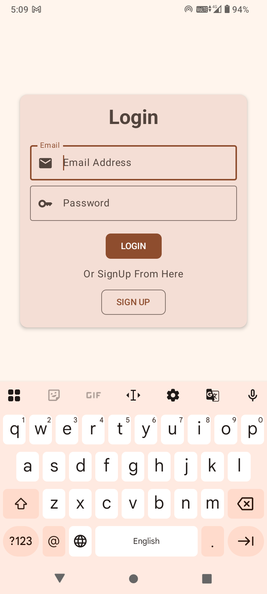
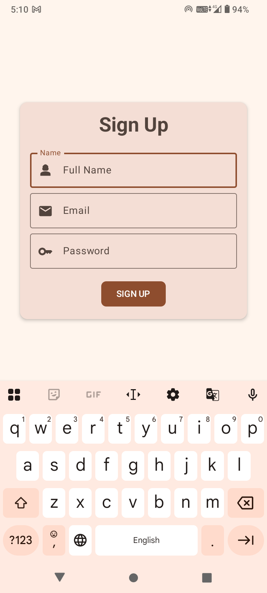
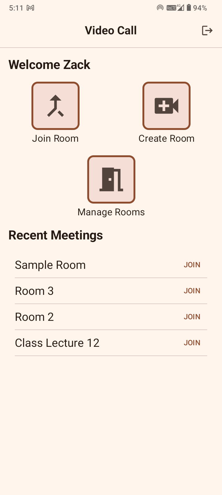
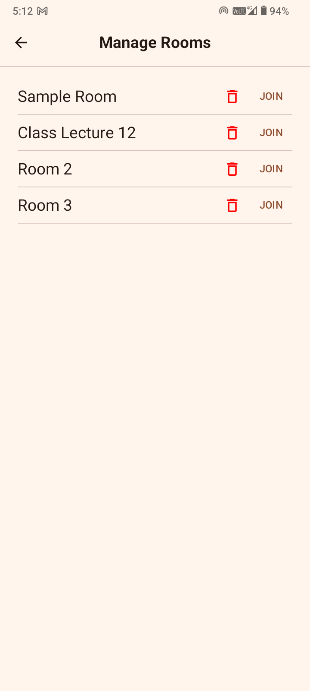
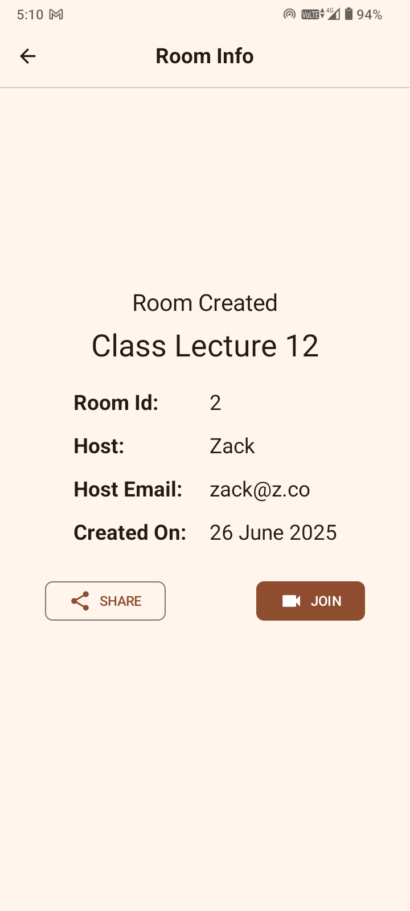
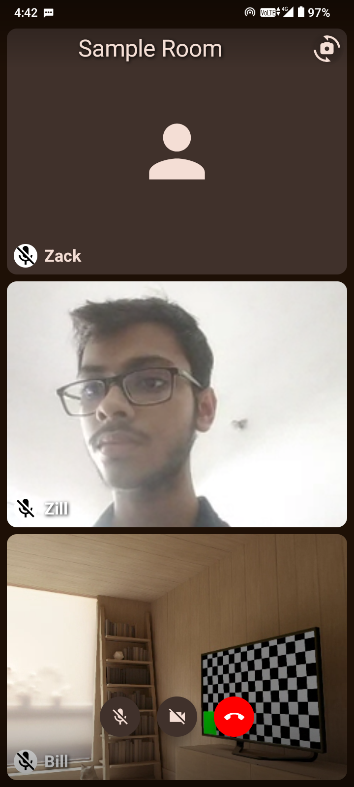

 📞 VideoCall - Android Video Calling App with Node.js Backend

**VideoCall** is a full-stack, end-to-end encrypted video calling application built with modern Android tools and a scalable WebRTC-based SFU backend powered by mediasoup.

## 📱 Features

- 🔐 Custom Authentication System (Sign up / Sign in)
- 🏠 Create, Join, and Manage Video Call Rooms
- 📜 Recently Accessed Room History
- 🎥 Supports device microphone and both front/back cameras
- 📡 Basic media stream publishing and consumption
- 📲 Adaptive UI to Support Multiple Peers
- 🚀 Real-Time Communication via WebSocket and mediasoup

---

## 🧩 Tech Stack

### 📱 Android Client
- [Jetpack Compose](https://developer.android.com/jetpack/compose) – Modern declarative UI
- [Hilt](https://developer.android.com/training/dependency-injection/hilt-android) – Dependency Injection
- [Socket.IO Java Client](https://github.com/socketio/socket.io-client-java) – Real-time client communication
- [mediasoup-client](https://github.com/haiyangwu/mediasoup-client-android) – WebRTC-based media engine

### 🖥️ Backend Server
- [Node.js & Express](https://expressjs.com/) – Web server and API framework
- [Socket.IO](https://socket.io/) – Real-time communication
- [PostgreSQL](https://www.postgresql.org/) – User & room persistence
- [mediasoup](https://mediasoup.org/) – SFU (Selective Forwarding Unit) for WebRTC

---

## 📱 Screenshots

## 📱 Screenshots

| Login | Sign Up | Home |
|:-----:|:--------:|:----:|
|  |  |  |

| Manage Rooms | Room Info | Video Call |
|:------------:|:----------:|:----------:|
|  |  |  |
